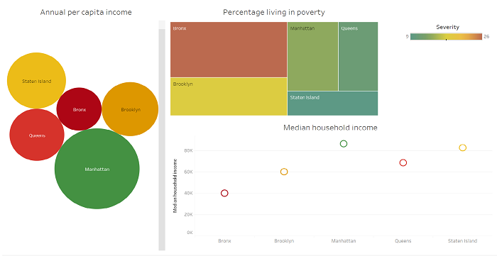
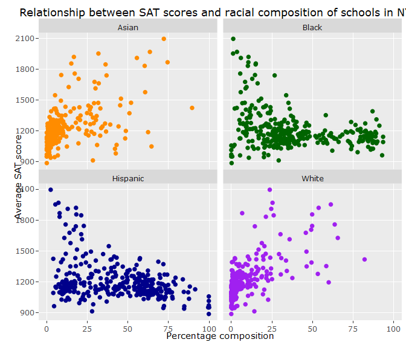

NYC Schools Survey Project
================
Fredrick Boshe
30/03/2021

# An analysis of a surveyed perception of New York City school quality

This project looks into the perceptions of students, teachers and
parents on the quality of New York City schools.

Questions looking to be answered are:

1.  What is the relationship between demography and school performance?
2.  Are the perceptions related to/influenced by the demographics and
    success metrics of the school?
3.  Do the survey respondents have similar perceptions regarding the
    quality of NYC schools?

The survey data can be found
[here](https://data.cityofnewyork.us/Education/2011-NYC-School-Survey/mnz3-dyi8)
while the performance and demographics data can be found
[here](https://data.world/dataquest/nyc-schools-data/workspace/file?filename=combined.csv).

### Load relevant packages

``` r
#Loading packages
library(tidyverse)
library(ggplot2)
library(dplyr)
library(corrplot)
library(plotly)
library(ggcorrplot)
devtools::install_github("hadley/emo")
```

### Import and preview data

``` r
combined<-read_csv("combined.csv")
gened<-read_tsv("masterfile11_gened_final.txt")
spced<-read_tsv("masterfile11_d75_final.txt")

glimpse(combined)
glimpse(gened)
glimpse(spced)
```

Both gened dataframe (General education schools) and spced dataframe
(Special education schools), have a key (dbn) that can be matched to the
combined dataframe (performance and demographics).

Special attention to rename “dbn” to “DBN” so they can match. Also note
that some variables such as “principal”, are not useful to this
analysis. We shall drop such columns. Read the dataset dictionary for
more information

The survey data is also granular, we would like to obtain aggregate
perceptions of respondents for the schools in question.

The factors that respondents were surveyed on were:

  - Safety and Respect
  - Communication
  - Engagement
  - Academic Expectations

The surveyed groups were:

  - Parents
  - Teachers
  - Students
  - Total (The average of parent, teacher, and student scores)

### **Data cleaning and manipulation**

``` r
#Filter to remain with high school and aggregate columns only
gened_clean<-gened%>%
  rename(DBN=dbn)%>%
  filter(schooltype=="High School")%>%
  select(-2:-7,-33:-1942 )


spced_clean<-spced%>%
  rename(DBN=dbn)%>%
  filter(is.na(highschool))%>%
  select(-2:-7, -33:-1773)

#Check missing values
colSums(is.na(gened_clean)) #Two missing student respondents
colSums(is.na(spced_clean)) #One missing student respondent

#Combine the dataframes
survey<-rbind(gened_clean,spced_clean)

combined<-combined%>%
  right_join(survey, by="DBN") #right join so we only keep corresponding data that we can use to compare
```

Using right\_join() helps keep all the survey data that corresponds to
matching demographic and school performance data.

We analyze how perception relates to demographic and school performance
via a correlation matrix.

### Relationship Analysis

#### **Disparity in performance between NYC Boroughs**

``` r
#Analyze the disparity in performance between the Boroughs
combined_boro<-combined%>%
  filter(!is.na(boro))

combined_boro_longer<-combined_boro%>%
  pivot_longer(cols = c(asian_per, black_per, hispanic_per, white_per),
               names_to="race",
               values_to="percent")

#Plot Performance disparity between Boroughs
fig1<-combined_boro_longer%>%ggplot(aes(x=boro, y=avg_sat_score, fill=boro))+
  geom_boxplot()+
  labs(title = "Average school performance by Borough in NYC (2011)",
       y="Average SAT Score",
       x="Borough",
       fill="Borough")+
  theme(plot.title = element_text(hjust = 0.5))
```

<center>


</center>

<br><br> Schools in the Bronx are averaging lower SAT scores as compared
to schools in Manhattan or Staten Island. This is not surprising
considering the Socio-economic profile of the Boroughs in New York City.
<br><br>

<center>



</center>

<br><br>

### **Trend of NYC school performance with racial diversity of schools**

#### **How racial diversity relates to school performance**

``` r
#Relationship between school performance and their racial diversity
race.labs<-c("Asian", "Black", "Hispanic", "White")
names(race.labs)<-c("asian_per", "black_per", "hispanic_per",
                    "white_per")

fig2<-combined_race_longer%>%ggplot(aes(x=percent, y=avg_sat_score, color=race))+
  geom_point()+
  labs(title="Relationship between SAT scores and racial composition of \nschools in NYC",
       x= "Percentage composition",
       y= "Average SAT score")+
  scale_color_manual(
    name="Race",
    values = c("Darkorange", "DarkGreen", "DarkBlue", "Purple"),
    labels=c("Asian", "Black", "Hispanic", "White")
  )+
  theme(plot.title = element_text(hjust = 0.5))+
  facet_wrap(~race, labeller = labeller(race=race.labs))
```

<center>



</center>

Schools with a higher proportion of Black and Hispanic have lower SAT
scores as compared to schools with a higher share of White and Asian
students.This could be due to the location, programs and resources at
the disposal of schools.

Schools in boroughs like Staten Island and Manhattan would have more
resources and have a higher proportion of White and Asian students as
compared to schools in Bronx and Brooklyn.

#### **How schools with special programs fair in academic performance**

``` r
#Trend of SAT scores with the type of program available for students
prog.labs<-c("Learning to speak English", "Receiving lunch discount",
             "Receiving specialized teaching")
names(prog.labs)<-c("ell_percent","frl_percent", "sped_percent")

fig3<-combined_type_longer%>%ggplot(aes(x=percent, y=avg_sat_score, color=`Type of program`))+
  geom_point()+
  labs(title="Relationship between SAT scores and socioeconomic factors",
       x= "Percentage composition",
       y= "Average SAT score")+
  scale_color_manual(
    name="Student",
    values = c("maroon", "forestgreen", "chocolate"),
    labels=c("Receiving lunch \ndiscount", "Learning to speak \nEnglish", "Receiving specialized \nteaching")
  )+
  theme(plot.title = element_text(hjust = 0.5))+ #strip.text.x = element_blank()
  facet_wrap(~`Type of program`, labeller = labeller(`Type of program`=prog.labs))
```

<center>


</center>

The most significant observation is how drastically school performance
drops with increase in number of students eligible for lunch discount at
a school. This is an indication of a school being in a socially and
economically disadvantaged location. Such schools rarely have enough
resources to help students perform better academically.

An increase in the sahre of students learning to speak English is also
related to lower academic performance for the school. Learning to speak
English can be an indicator of share of students with a lower economic
migrant background. <br><br>

``` r
p.mat<-cor_pmat(cor_mat)#pvalues

cor_tib<-cor_mat%>%
  as_tibble(rownames="variable")#A tibble for easier viewing


#Variables with strong relationship with Avg sat score
strong_cor<-cor_tib%>%
  select(variable, Avg_SAT_score)%>%
  filter(Avg_SAT_score  < -0.25|Avg_SAT_score >0.25)


strong_cor_mat<-as.matrix(strong_cor)

#Plot matrix table to see strength of relationships
fig4 <- ggcorrplot(
  cor_mat, hc.order = TRUE, type = "lower", title = "Correlation matrix between school \nperformance and demographics", outline.col = "white",
  p.mat = p.mat
  )
```

<center>


</center>

A correlation analysis shows how strong the relationships between racial
diversity and school programs are with the academic performance of the
school.

When it comes to demographics, academic performance shows a strong
positive correlation with the percentage of white students in a school
(r= 0.65). While it has the strongest negative relationship with the
percentage of students that are eligible for food discount at a school
(r= -0.72).

Overall, the strongest positive relationships are among the perceptions
of NYC schools. The respondents (teachers, students and parents) of the
survey seem to have correlating perceptions of how NYC schools perform
when it comes to academic performance, communication, engagement and
safety.

#### **How teachers, students and parents rate NYC schools**

``` r
#establish average scores per respondent group

survey_score<-combined%>%
  mutate(parent_score_avg=(saf_p_11+com_p_11+eng_p_11+aca_p_11)/4)%>%
  mutate(teacher_score_avg=(saf_t_11+com_t_11+eng_t_11+aca_t_11)/4)%>%
  mutate(student_score_avg=(saf_s_11+com_s_11+eng_s_11+aca_s_11)/4)

#Pivot table longer to make it easier to plot on same scatter plot
survey_score_longer<-survey_score%>%
  pivot_longer(cols = c(parent_score_avg, teacher_score_avg, student_score_avg),
               names_to= "respondent",
               values_to= "avg_score")


#Plot the spread of the respondents average scores
fig5<-survey_score_longer%>%ggplot(aes(x=respondent, y=avg_score, fill=respondent))+
  geom_boxplot()+
  scale_x_discrete(labels=c("parent_score_avg" = "Parent", "student_score_avg" = "Student","teacher_score_avg" = "Teacher"))+
  labs(title = "Perception of NYC schools quality (survey responses)",
       y="Average rating",
       x="Respondent")+
  theme(plot.title = element_text(hjust = 0.5))
fig5
```


<br><br> Overall, parents seem to rate NYC schools the highest while
students (not surprisingly 😄) are rating the schools lowest. Teachers
show the most broad rating of NYC schools.

#### **Survey responses on quality of NYC schools**

``` r
#Pivot table longer to establish individual rating per question type
que_score<-combined%>%
  pivot_longer(cols = c(saf_p_11:aca_s_11),
               names_to="questions",
               values_to="rating")

#Create variables out of the pivoted column
que_score <- que_score %>%
  mutate(respondent = str_sub(questions, 4, 6)) %>%   
  mutate(question = str_sub(questions, 1, 3))


que_score <- que_score%>%
  mutate(respondent = ifelse(respondent  == "_p_", "parent", 
                                ifelse(respondent  == "_t_", "teacher",
                                       ifelse(respondent  == "_s_", "student", 
                                              ifelse(respondent  == "_to", "total", "NA")))))


#Boxplot to see if there appear to be differences in how the three groups of responders (parents, students, and teachers) answered the four questions. 

que_score<-as.data.frame(que_score)

fig6<-plot_ly(data = que_score, x=~question, y =~rating, color =~respondent, 
        type = "box") %>% 
         layout(boxmode = "group", title="NYC School quality perception survey questions and responses",
         xaxis = list(title='survey questions',
                      ticktext = list("Academic \nExpectations", "Communication", "Engagement", "Safety and \nRespect"), 
      tickvals = list("aca","com","eng","saf"), 
         yaxis = list(title='Percentage')))

fig6
```


<b><br>

Looking on how individual groups responded, the best rating was for
**safety and respect** by parent respondents and the lowest was for
**communication** by student respondents.
