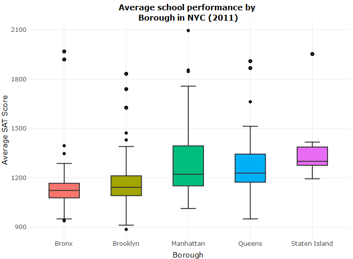

NYC Schools Survey Project
================
Fredrick Boshe
30/03/2021

# An analysis of a surveyed perception of New York City school quality

This project looks into the perceptions of students, teachers and
parents on the quality of New York City schools.

Questions looking to be answered are:

1.  What is the relationship between demography and school performance?
2.  Are the perceptions related to/influenced by the demographics and
    success metrics of the school?
3.  Do the survey respondents have similar perceptions regarding the
    quality of NYC schools?

The survey data can be found
[here](https://data.cityofnewyork.us/Education/2011-NYC-School-Survey/mnz3-dyi8)
while the performance and demographics data can be found
[here](https://data.world/dataquest/nyc-schools-data/workspace/file?filename=combined.csv).

The factors that respondents were surveyed on were:

  - Safety and Respect
  - Communication
  - Engagement
  - Academic Expectations

The surveyed groups were:

  - Parents
  - Teachers
  - Students
  - Total (The average of parent, teacher, and student scores)

### Relationship Analysis

#### **Disparity in performance between NYC Boroughs**
Schools in the Bronx are averaging lower SAT scores as compared to schools in Manhattan or Staten Island. This is not surprising
considering the Socio-economic profile of the Boroughs in New York City.

 
  

To read the full project (with code) see [**this github page**](https://rickyboshe.github.io/projects/index.html). For a lighter read, with more context, see [**this medium article**](https://fredrick-boshe.medium.com/how-perceptions-can-miss-out-on-reality-a-data-visualisation-approach-339291576010) i wrote. Comments and feedback are welcomed!
